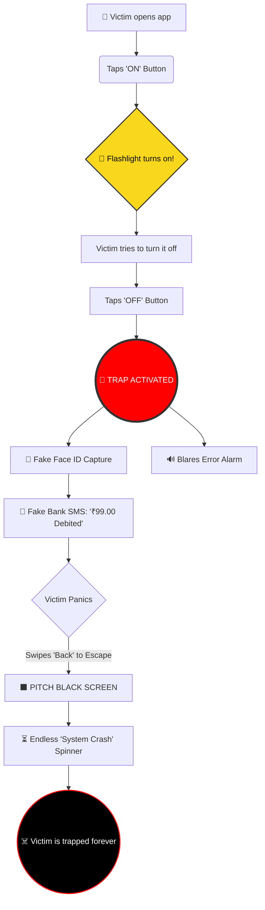

# 🔦 TorchTrap 
### The Ultimate Flashlight Prank

  
  
  

<strong>Because turning on a flashlight is easy... but turning it off shouldn't be. 😈</strong>

---

## 🎭 About The Project

**TorchTrap** is a brilliant, psychological prank application disguised as a sleek, premium, iOS-style flashlight utility for Android. 

At first glance, it functions perfectly—users tap a beautiful, haptic-feedback-enabled "ON" button, and their phone's camera flash illuminates the darkness. But when they try to turn it off? The trap springs.

What begins as a simple utility instantly devolves into a hilarious, terrifying gauntlet of fake paywalls, aggressive alarms, system crash simulations, and biometric scares, leaving your friends frantically trying to figure out how to escape without paying a ransom!

---

## 🗺️ The Trap Overflow Diagram

Here is exactly what happens to the victim once they fall into the trap:

---

## ✨ Features 

| Feature | Description |
| :--- | :--- |
| **🍏 Premium Disguise** | A stunning, modern UI built with Jetpack Compose that mimics a high-end iOS system utility to lower the victim's guard. |
| **💸 The Ransom Paywall** | The "OFF" button is permanently locked behind a terrifying ₹99.00 payment demand. |
| **🚨 The System Buzzer** | Any attempt to interact with the locked button triggers a jarring, abrasive hardware alarm tone. |
| **📸 Fake Biometrics** | The app flashes the screen bright white and fakes a facial recognition capture to simulate an unauthorized transaction. |
| **💬 Bogus Bank SMS** | A highly realistic system notification overlay drops down, convincing the user their bank account has just been debited. |
| **💀 The Bricked OS Trap** | Intercepts the Android "Back" gesture, plunges the screen into absolute pitch black darkness, blares a fatal hardware intercept beep, and displays an endless loading ring. |

---

## 🚀 Installation

1. Navigate to the **[Releases](../../releases)** page of this repository.
2. Download the latest `app-debug.apk` file to your Android device.
3. Open the downloaded file and install the application *(you may need to allow "Install from Unknown Sources" in your Android settings)*.
4. Hand your phone to a friend and ask them to "use your flashlight for a second."

---

## 🛠️ Tech Stack

*   **Kotlin** - First-class and official programming language for Android development.
*   **Jetpack Compose** - Android's modern toolkit for building native UI.
*   **Camera2 API** - For low-level hardware flashlight access.
*   **ToneGenerator API** - For generating terrifying system-level error buzzers and alarms.

---

## ⚠️ Disclaimer

> [!WARNING]
> This application is strictly for educational, entertainment, and comedic purposes. It does **not** actually charge money, capture biometrics, access bank accounts, or crash operating systems. It is entirely a localized UI simulation designed for harmless pranks. 

 

  <i>Have fun, and happy trapping! 🔦</i>

